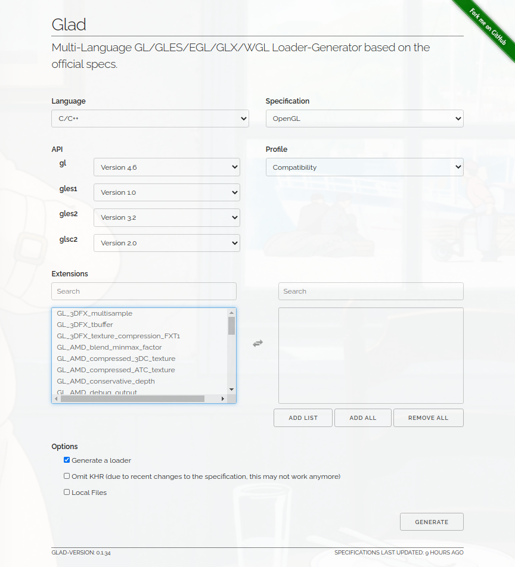

# OpenGL入门

[TOC]

## 推荐网站

- 官方网站：https://www.opengl.org/
- 中文教程：https://learnopengl-cn.github.io/
- OpenGL API 文档：https://docs.gl/

> 笔记中这样的引用大多来自上述网站

## 开始前的准备

### 包含头文件

```c++
#include <glad/glad.h>
```



处理 OpenGL 中的复杂的变量和宏 | http://www.glfw.org/download.html

```cpp
#include <GLFW/glfw3.h>
```

使 OpenGL 在窗口中渲染 | http://www.glfw.org/download.html

> GLFW是一个专门针对OpenGL的C语言库，它提供了一些渲染物体所需的最低限度的接口。
> 它允许用户创建OpenGL上下文，定义窗口参数以及处理用户输入。

```cpp
#include <stb_image.h>
```

材质贴图加载 | https://github.com/nothings/stb

## 状态机和对象

> OpenGL自身是一个巨大的**状态机**(State Machine)，一系列的变量描述OpenGL此刻应当如何运行。
> OpenGL的状态通常被称为OpenGL**上下文**(Context)。

- 状态设置函数
- 状态使用函数

> 在OpenGL中一个对象是指一些选项的集合，它代表OpenGL状态的一个子集。
> 可以把对象看做一个C风格的结构体(Struct)：

```cpp
// OpenGL的状态
struct OpenGL_Context {
    // ...
    object* object_Window_Target;
    // ...
};
```

```cpp
// 创建对象
unsigned int objectId = 0;
glGenObject(1, &objectId);
// 绑定对象至上下文
glBindObject(GL_WINDOW_TARGET, objectId);
// 设置当前绑定到 GL_WINDOW_TARGET 的对象的一些选项
glSetObjectOption(GL_WINDOW_TARGET, GL_OPTION_WINDOW_WIDTH, 800);
glSetObjectOption(GL_WINDOW_TARGET, GL_OPTION_WINDOW_HEIGHT, 600);
// 将上下文对象设回默认
glBindObject(GL_WINDOW_TARGET, 0);
```
> 这一小段代码展现了你以后使用OpenGL时常见的工作流。
> 我们首先创建一个对象，<br>
> 然后用一个id保存它的引用（实际数据被储存在后台）。<br>
> 然后我们将对象绑定至上下文的目标位置（例子中窗口对象目标的位置被定义成GL_WINDOW_TARGET）。<br>
> 接下来我们设置窗口的选项。<br>
> 最后我们将目标位置的对象id设回0，解绑这个对象。

> 设置的选项将被保存在objectId所引用的对象中，一旦我们重新绑定这个对象到
> GL_WINDOW_TARGET位置，这些选项就会重新生效。
